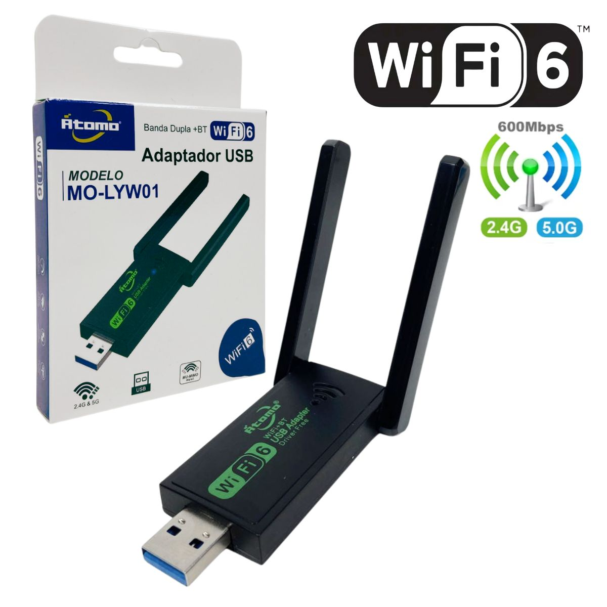

## Driver AIC8800D80 no Debian 13 (com Secure Boot)

Suporte para dongles USB 3.0 com chipset AIC8800D80 (ex.: `a69c:5721` → modeswitch → `a69c:8d80`).

- **Distribuição**: Debian 12/13
- **Kernel testado**: `6.12.48+deb13-amd64`
- **Estado do Bluetooth**: atualmente não suportado neste driver (Wi‑Fi apenas)

Adaptador utilizado<br />
ADAPTADOR USB ANTENA WIFI WIRELESS 2.4GHZ + 5GHZ 600MBPS 802.11AX ATOMO MO-LYW01


### Requisitos

```bash
sudo apt update
sudo apt install -y build-essential git linux-headers-$(uname -r) kmod mokutil openssl ca-certificates
```

### Instalação (Wi‑Fi)

1) Obter o driver e instalar regra/firmware
```bash
cd ~
git clone https://github.com/shenmintao/aic8800d80.git
cd aic8800d80

# Regra udev para converter de Mass Storage (5721) para WLAN (8d80)
sudo cp aic.rules /lib/udev/rules.d/

# Firmware Wi‑Fi
sudo cp -r ./fw/aic8800D80 /lib/firmware/
```

2) Compilar e instalar o módulo
```bash
cd drivers/aic8800
make clean
make -j"$(nproc)"
sudo make install
sudo depmod -a
```

### Secure Boot (assinatura segura do módulo)

Com Secure Boot ativo, assine **apenas** os módulos externos do AIC (não assine módulos do kernel, nem arquivos comprimidos `.ko.xz/.zst`).

1) Gerar chave MOK local
```bash
mkdir -p ~/aic-mok && cd ~/aic-mok
openssl req -new -x509 -newkey rsa:2048 -keyout MOK.priv -outform DER -out MOK.der -nodes -days 36500 -subj "/CN=AIC8800 Local/"
```

2) Assinar somente os módulos do AIC
```bash
SF="/usr/src/linux-headers-$(uname -r)/scripts/sign-file"; [ -x "$SF" ] || SF="$(command -v sign-file || echo /usr/lib/linux-kbuild-$(uname -r | cut -d. -f1,2)/scripts/sign-file)"

sudo "$SF" sha256 ~/aic-mok/MOK.priv ~/aic-mok/MOK.der "$(modinfo -n aic8800_fdrv)"
# Caso exista no seu build:
sudo "$SF" sha256 ~/aic-mok/MOK.priv ~/aic-mok/MOK.der "$(modinfo -n aic_load_fw 2>/dev/null)"

sudo depmod -a
```

3) Importar a chave e inscrever no boot
```bash
sudo mokutil --import ~/aic-mok/MOK.der
sudo reboot
# Tela azul (MokManager): Enroll MOK → Continue → Yes → digite a senha → reboot
```

### Uso

1) Plugue o dongle; o udev deve alternar de `a69c:5721` (MSC) para `a69c:8d80` (WLAN)
2) Carregue e verifique o módulo
```bash
sudo modprobe aic8800_fdrv
lsmod | grep aic
dmesg | tail -n 200 | grep -i aic
```

### Solução de Problemas

- **Erro: Key was rejected by service**
  - A chave MOK não foi inscrita. Verifique/inscreva:
  ```bash
  mokutil --sb-state
  mokutil --list-enrolled
  sudo mokutil --import ~/aic-mok/MOK.der && sudo reboot
  ```

- **depmod: xz: File is corrupt / aic7xxx/aic79xx/aic94xx**
  - Você assinou indevidamente módulos do kernel comprimidos. Reinstale os pacotes dos módulos do kernel e regenere índices:
  ```bash
  sudo apt update
  sudo apt install -y --reinstall linux-modules-$(uname -r) linux-modules-extra-$(uname -r) || true
  sudo apt install -y --reinstall linux-image-$(uname -r) || true
  sudo update-initramfs -u
  sudo depmod -a
  ```

- **Dispositivo fica em Mass Storage (5721) e não muda**
  - Remova regras customizadas do `usb_modeswitch` para `a69c:5721` e mantenha apenas a `aic.rules`:
  ```bash
  sudo rm -f /etc/udev/rules.d/*a69c*5721*.rules
  sudo cp ~/aic8800d80/aic.rules /lib/udev/rules.d/
  sudo udevadm control --reload && sudo udevadm trigger
  ```

- **Bluetooth**
  - Não há suporte funcional neste driver no momento. Mesmo que o hardware possua BT, o PID `8d80` exposto após o modeswitch pode ser somente Wi‑Fi. Caso o kernel não mostre `btusb` e `bluetoothctl list` não exiba adaptador, considere BT como não suportado.

### Desinstalação/Limpeza

```bash
sudo nmcli radio wifi off || true
sudo modprobe -r aic8800_fdrv aic_load_fw 2>/dev/null || true

sudo rm -rf /lib/firmware/aic8800D80
sudo rm -f /lib/udev/rules.d/aic.rules

sudo find /lib/modules/$(uname -r) -type f -name 'aic8800_fdrv.ko*' -delete
sudo find /lib/modules/$(uname -r) -type f -name 'aic_load_fw.ko*' -delete

sudo depmod -a
sudo update-initramfs -u
```

### Notas e Créditos

- Código do driver baseado no trabalho do repositório `shenmintao/aic8800d80`.
- Use o firmware correspondente à sua variante; firmware incorreto pode travar o sistema.
- Este README foca em Debian 12/13 com Secure Boot ativo e assinatura local de módulos externos.